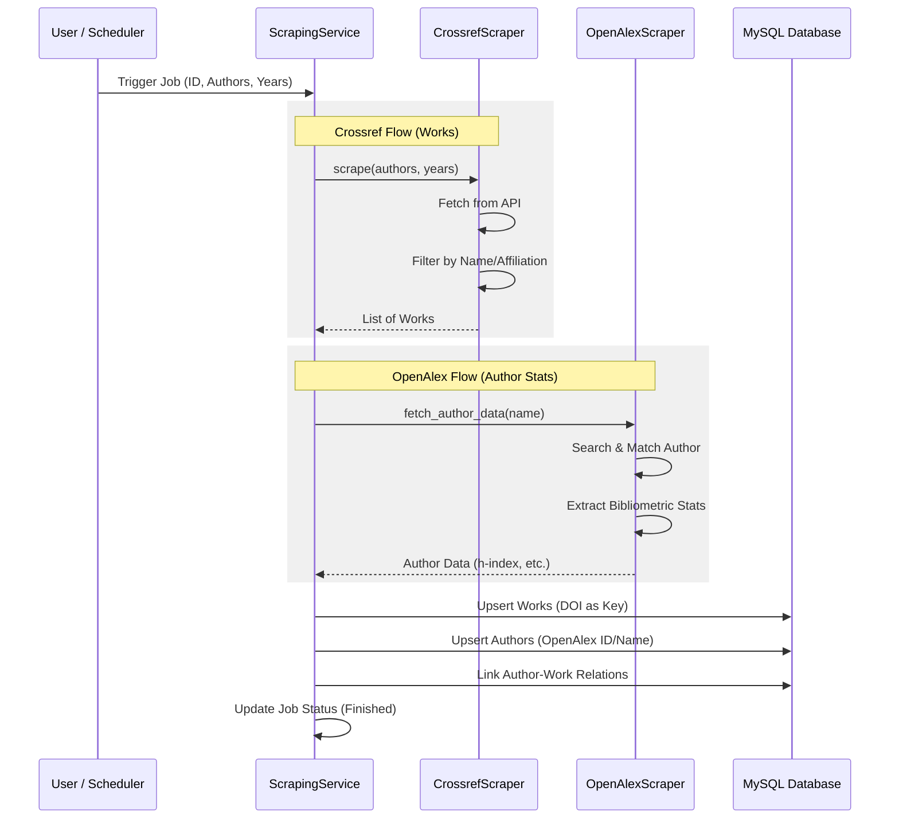

# FastAPI Academic Data Scraper

[](https://www.python.org/downloads/)
[](https://fastapi.tiangolo.com/)
[](https://github.com/astral-sh/uv)

Backend service untuk scraping data akademik dari Crossref dan OpenAlex API, dengan penyimpanan ke MySQL.

## Fitur

- 🔍 **Scraping Data Akademik**
  - Crossref: Data publikasi (DOI, title, authors, citations, dll)
  - OpenAlex: Data author (ORCID, h-index, works count, dll)
- ⏰ **Scheduled Scraping**
  - Scraping otomatis bulanan menggunakan APScheduler
  - Konfigurasi tanggal eksekusi via environment variable

- 📊 **Job Tracking**
  - Progress tracking real-time
  - Status: pending, running, finished, failed
  - Logging per job

- 🔒 **Security**
  - API key authentication untuk endpoint protected
  - CORS middleware
  - Rate limiting pada API calls

- 💾 **Database**
  - MySQL dengan SQLAlchemy ORM
  - Idempotent operations (upsert dengan ON DUPLICATE KEY UPDATE)
  - Raw response storage untuk debugging

## Tech Stack

- **Framework**: FastAPI
- **Database**: MySQL + SQLAlchemy (async)
- **HTTP Client**: httpx (async)
- **Scheduler**: APScheduler
- **Package Manager**: uv

## Getting Started

### Prerequisites

- Python 3.10+
- MySQL 8.0+
- [uv](https://github.com/astral-sh/uv) package manager

```sh
# Install uv (Windows)
powershell -c "irm https://astral.sh/uv/install.ps1 | iex"

# Install uv (macOS/Linux)
curl -LsSf https://astral.sh/uv/install.sh | sh
```

### Installation

1. **Clone repository**

```sh
git clone <repository-url>
cd KP-FastAPI
```

2. **Create virtual environment**

```sh
uv venv
.venv\Scripts\activate  # Windows
source .venv/bin/activate  # macOS/Linux
```

3. **Install dependencies**

```sh
uv sync
```

4. **Setup environment variables**

```sh
cp .env.example .env
# Edit .env dengan konfigurasi Anda
```

5. **Setup database**

```sh
# Buat database MySQL
mysql -u root -p -e "CREATE DATABASE academic_scraper"

# Jalankan schema (opsional, ORM akan auto-create)
mysql -u root -p academic_scraper < database/schema.sql
```

### Configuration

Edit file `.env`:

```env
# Database
DB_HOST=localhost
DB_PORT=3306
DB_USER=root
DB_PASSWORD=your_password
DB_NAME=academic_scraper

# API Security
API_KEY=your-secure-api-key

# Scheduler
SCHEDULER_ENABLED=true
SCRAPE_DAY_OF_MONTH=1

# Scraping
YEAR_START=2021
YEAR_END=2026
```

### Running

```sh
# Development mode (auto-reload)
uv run fastapi dev

# Production mode
uv run fastapi run
```

Server akan berjalan di `http://localhost:8000`

## API Endpoints

### Health Check

```http
GET /health
```

Response:

```json
{
  "status": "healthy",
  "version": "1.0.0",
  "environment": "development",
  "database": "connected",
  "scheduler": {
    "enabled": true,
    "running": true,
    "next_run": "2024-02-01T02:00:00"
  }
}
```

### Trigger Scraping

```http
POST /api/v1/scrape
X-API-Key: your-api-key
Content-Type: application/json

{
  "source": "both",
  "year_start": 2021,
  "year_end": 2024,
  "authors": ["John Doe", "Jane Smith"]
}
```

Response:

```json
{
  "job_id": "550e8400-e29b-41d4-a716-446655440000",
  "status": "pending",
  "message": "Scraping job created successfully",
  "created_at": "2024-01-15T10:30:00Z"
}
```

### List Jobs

```http
GET /api/v1/jobs?status=running&limit=10
```

### Get Job Detail

```http
GET /api/v1/jobs/{job_id}
```

## Project Structure

```
app/
├── __init__.py
├── main.py                 # Application entry point
├── core/
│   ├── config.py          # Configuration with Pydantic
│   ├── database.py        # SQLAlchemy async setup
│   ├── security.py        # API key authentication
│   └── server.py          # FastAPI app factory
├── models/                 # SQLAlchemy ORM models
│   ├── job.py             # ScrapingJob, ScrapingLog
│   ├── author.py          # Author (OpenAlex)
│   ├── work.py            # Work, AuthorWork (Crossref)
│   └── raw_response.py    # Raw API responses
├── services/
│   ├── job_service.py     # Job lifecycle management
│   ├── scraping_service.py # Scraping orchestration
│   ├── scheduler_service.py # APScheduler setup
│   └── scraper/           # Scraper implementations
│       ├── base.py        # Base with retry/rate limit
│       ├── crossref.py    # Crossref API scraper
│       ├── openalex.py    # OpenAlex API scraper
│       └── utils.py       # Name normalization, etc
├── api/
│   ├── schemas.py         # Pydantic request/response models
│   ├── health_route.py    # Health check endpoint
│   └── v1/
│       ├── router.py      # V1 API router
│       ├── scrape.py      # POST /scrape endpoint
│       └── jobs.py        # GET /jobs endpoints
└── Reference/              # Reference scraping code (JS)
    ├── author/openalex/
    └── jurnal/crossref/
```

## Alur Proses Scraping

Sistem ini menjalankan proses scraping melalui beberapa tahapan koordinasi antara service dan API eksternal.

### Diagram Urutan (Sequence Diagram)



### Penjelasan Langkah-langkah

1.  **Inisiasi Job**:
    - **Manual**: Melalui endpoint `POST /api/v1/scrape`.
    - **Otomatis**: Melalui `APScheduler` yang berjalan setiap bulan (dikonfigurasi via `SCRAPE_DAY_OF_MONTH`).
2.  **Orkestrasi Service**:
    - `ScrapingService` mengambil antrian job dan memulai proses scraping. Daftar nama author diambil langsung dari database (tabel `authors`) secara otomatis.
3.  **Proses Crossref (Data Publikasi)**:
    - Melakukan query ke Crossref API untuk setiap author dan tahun.
    - Menerapkan filter normalisasi nama dan afiliasi (opsional UNIKOM).
    - Mengekstrak 22+ field data publikasi termasuk DOI, judul, publisher, dan sitasi.
4.  **Proses OpenAlex (Statistik Author)**:
    - Mencari profil author berdasarkan nama yang telah dinormalisasi (menghapus gelar).
    - Mengambil statistik bibliometrik seperti **h-index**, **i10-index**, dan jumlah karya.
5.  **Penyimpanan Data (Persistence)**:
    - **Upsert Strategy**: Menggunakan `ON DUPLICATE KEY UPDATE` untuk memastikan data terbaru tanpa duplikasi.
    - **Mapping**: Menghubungkan ID author dengan ID publikasi di tabel `author_works`.
    - **Logging**: Setiap progres dicatat ke dalam tabel `scraping_logs`.

## Database Schema

```
┌─────────────────┐     ┌─────────────────┐
│  scraping_jobs  │────<│  scraping_logs  │
└─────────────────┘     └─────────────────┘
        │
        └──────────────<┌─────────────────┐
                        │  raw_responses  │
                        └─────────────────┘

┌─────────────────┐     ┌─────────────────┐     ┌─────────────────┐
│    authors      │────<│  author_works   │>────│     works       │
└─────────────────┘     └─────────────────┘     └─────────────────┘
```

## Reference Code Integration

Scraper implementations adapted from reference JavaScript code:

- **Crossref** (`Reference/jurnal/crossref/main.js`):
  - Pagination dengan offset/rows
  - Filter by author dan tahun
  - Exact author matching
  - UNIKOM affiliation filter

- **OpenAlex** (`Reference/author/openalex/match-author-openalex.js`):
  - Search by author name
  - Academic title stripping
  - Bibliometric stats extraction

## Docker

```sh
# Build image
docker build -t fastapi-academic-scraper .

# Run container
docker run -p 8000:8000 --env-file .env fastapi-academic-scraper
```

## Documentation

- **OpenAPI/Swagger**: http://localhost:8000/docs
- **ReDoc**: http://localhost:8000/redoc

## License

MIT
