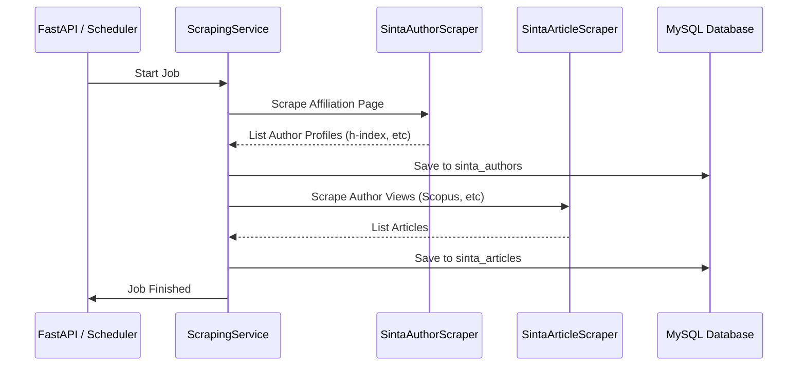

# FastAPI SINTA Data Scraper

[](https://www.python.org/downloads/)
[](https://fastapi.tiangolo.com/)
[](https://github.com/astral-sh/uv)

Backend service untuk scraping data akademik dari SINTA (Science and Technology Index) Indonesia, dengan penyimpanan ke MySQL. Project ini mengotomatisasi pengumpulan profil author dan daftar publikasi (Scopus, Garuda, Google Scholar, Rama).

## Fitur

- 🔍 **Scraping SINTA (Native HTML)**
  - **SINTA Authors**: Scraping data profil, metrik bibliometrik (h-index, i10-index, G-index), dan skor SINTA melalui data afiliasi.
  - **SINTA Articles**: Scraping daftar artikel publikasi dari 4 view utama (Scopus, Garuda, Google Scholar, Rama).
- ⏰ **Scheduled Scraping**
  - Scraping otomatis bulanan menggunakan APScheduler.
  - Konfigurasi tanggal eksekusi via environment variable.

- 📊 **Job Tracking**
  - Progress tracking real-time (background tasks).
  - Status: pending, running, finished, failed.
  - Logging detail per job untuk debugging.

- 💾 **Database**
  - MySQL dengan SQLAlchemy ORM (Async).
  - Skema data terpisah untuk profiling dan artikel.
  - Penyimpanan log aktivitas scraping.

## Tech Stack

- **Framework**: FastAPI
- **Database**: MySQL + SQLAlchemy (async)
- **HTTP Client**: httpx (async)
- **Parser**: BeautifulSoup4
- **Scheduler**: APScheduler
- **Package Manager**: uv

## Getting Started

### Prerequisites

- Python 3.10+
- MySQL 8.0+
- [uv](https://github.com/astral-sh/uv) package manager

### Installation

1. **Clone repository**
```sh
git clone <repository-url>
cd KP-FastAPI
```

2. **Setup virtual environment & install dependencies**
```sh
uv sync
```

3. **Setup environment variables**
```sh
cp .env.example .env
# Edit .env dengan database credentials Anda
```

### Configuration

Edit file `.env`:
```env
# Database
DB_NAME=kp-penelitian-dosen-scrap
DB_USER=root
DB_PASSWORD=password

# SINTA Config
SINTA_AFFILIATION_ID=528  # ID Afiliasi (Contoh: 528 untuk UNIKOM)
SINTA_REQUEST_DELAY=2.0   # Delay antar request (detik)
SINTA_MAX_RETRIES=3

# Scheduler
SCHEDULER_ENABLED=true
SCRAPE_DAY_OF_MONTH=1
```

### Running

```sh
# Development mode
uv run fastapi dev

# Production mode
uv run fastapi run
```

## API Endpoints

### 1. Trigger Scrape
`POST /api/v1/scrape`
Digunakan untuk memulai job scraping baru secara manual.

**Body:**
```json
{
  "source": "both", 
  "sinta_ids": [5974015, 6010534] 
}
```
*Note: `sinta_ids` bersifat opsional. Jika kosong, akan men-scrape artikel milik semua author yang ada di DB.*

### 2. Job Monitoring
- `GET /api/v1/jobs`: List semua job.
- `GET /api/v1/jobs/{job_id}`: Detail status job & log terbaru.

### 3. Data Retrieval
- `GET /api/v1/sinta-authors`: Mengambil semua data profil author hasil scrape.
- `GET /api/v1/sinta-articles`: Mengambil semua data artikel hasil scrape.

## Project Structure

```
app/
├── core/              # Konfigurasi, DB setup, security
├── models/            # SQLAlchemy ORM models (SintaAuthor, SintaArticle, Job)
├── services/
│   ├── scraper/       # Logika scraping HTML (SintaAuthorScraper, SintaArticleScraper)
│   ├── scraping_service.py  # Orchestrator scraping
│   └── job_service.py       # Manajemen lifecycle job
└── api/
    ├── v1/            # API routes
    └── schemas.py     # Pydantic models (Request/Response)
```

## Alur Proses Scraping



## License
MIT
